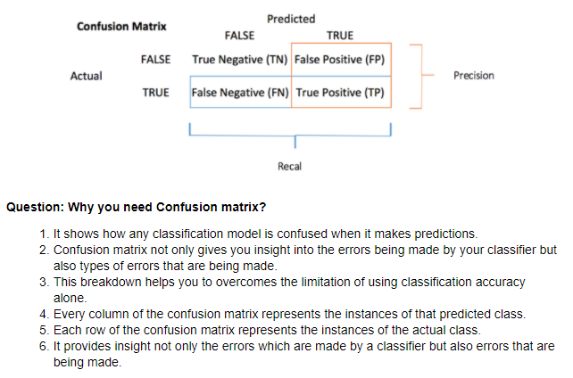
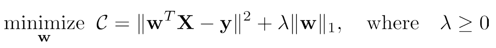
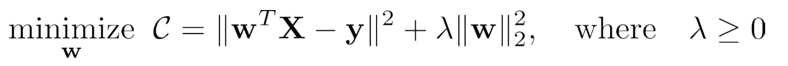
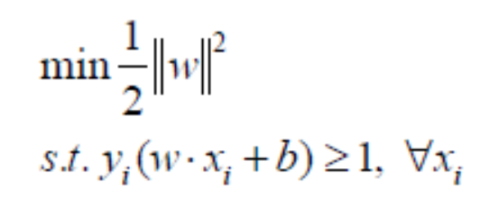
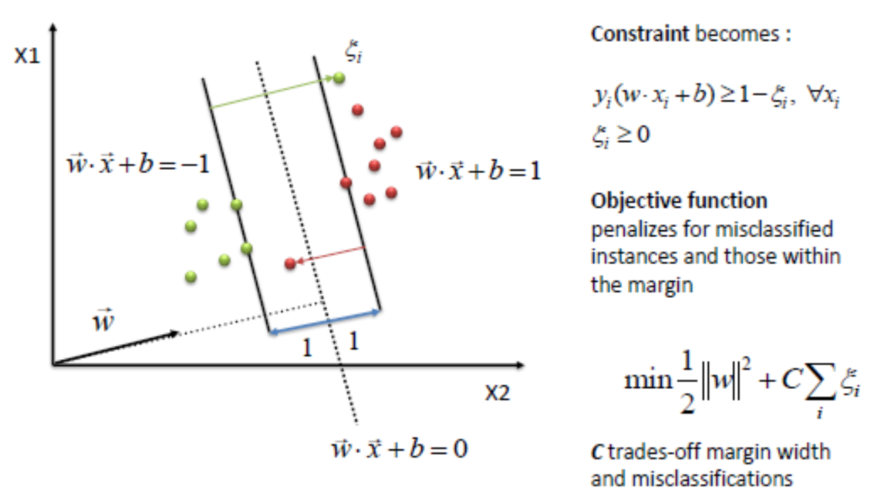
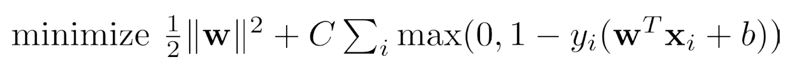

# Machine learning breath questions

## Machine Learning Process
0. Identification of project objectives.
1. Formulation of a mathematical problem.
2. Acquisition of training dataset.
3. Data Preparation/preprocessing (>60% time).
4. Model training(iterative step).
5. Model prediction.

## Supervised Learning vs Unsupervised Learning
Supervised learning algorithms are trained using **labeled** examples, such as an input where the desired output is known. Examples are email spam detection, where we train the model using category labeled data.

The unsupervised learning has bo labeled data. The model can identify patterns or relationships in the input data, most used for clustering problems. 

## Discriminative and Generative Models
The terminologies descript two main approaches in statistical modeling.
- Discriminative models solve classification directly via learning from the conditional predictive distribution p(y|x), x is the given dataset, y is the target or prediction. It learns the **boundary** between classes. Some classifiers such as, logistic regression, SVM, traditional neural networks are all discriminative models.
- Generative models learn the joint distribution p(x,y). It learns the distribution of dataset and **generate new data instances** from its learned distribution. Naive Bayes or GAN are generative models.

## Data preprocessing
### Missing value
1. Drop the data points with missing value. It is not always good if the point contains other non-missing information.
2. Imputation: replace the missing values with substitutions. It usually gives more accurate model than dropping the entire data point.
   - Fill in the empirical guess.
   - Fill in the mean value. Sometimes more complex statistical strategies may not give more benefit.
   - Use regression to predict the missing value.

### Imbalanced dataset
Imbalanced data refers to the classification problems where the classes are not represented equally. To many problems, imbalanced data is not only common, but expected. Like fraudulent transactions, the majority of tranctions will be not-fraud.

- The accuracy usually fails in evaluating the performance of a model trained by imbalanced dataset. So, to this kind of problems, should not use accuracy as the single metric to evaluate the model performance. Look into the confusion matrix in detail and consider precision, recall and F1 Score. ROC is also a good performance metric (see below).
- Try to collect more data if the imbalance came from insufficient sample number. 
- If the imbalance is due to the problem itself, try to resampling dataset. 
   - Over-sampling, sampling with replacement to the under-represented class
   - Under-sampling, remove data points from over-represented class
- Or generate synthetic samples, which randomly sample the attributes from instances in the under-presented class.
- Try to penalize the model by adding more cost (weight) on the minority class during training.
- Try different models. For example, tree methods often perform well on imbalanced datasets since they force both classes to be addressed. 

### Feature Scaling
Many machine learning algorithms are sensitive to feature scales. 
- For **gradient descent** based algorithms, the step is updated at the same rate for all features. Having feature on a similar scale can help the gradient descent converge more quickly.
- For **Distance-based** algorithms, such as KNN, KMeans, and SVM, they are using distances between data points to determine the similarity. Scaling allows all features equally contribute to the result.
- For tree methods, they are insensitive to the scale of features. For example, decision tree splits a node based on a single feature.

 

- **Normalization** is a scaling method also known as min-max scaling, who rescales the values ranging to [0,1]
- **Standardization** is another scaling method who rescales the values to a standard distribution with zero mean and unit deviation.
- No big rule to use normalization or standardization. Standardization can be suitable if the data follows a Gaussian distribution. It also has no bounded range (outliers are still outliers)

### Other preprocessing
- **One Hot Encoding**: transforms categorical data into an integer representation. Use a vector with N column, where N represents the number of unique values. Only one column takes value 1.

## Evaluation Metrics
### Classification error metrics
- **Accuracy**: (TP+TN)/(TP+TN+FP+FN) is the number of **correct predictions** divided by the total number of predictions. Accuracy is not good with unbalanced test dataset. 
- **Precision**: (TP)/(TP+FP) is a metric only identifies the **relevant** data. Indicate how sure to a certain prediction.
- **Recall**:  (TP)/(TP+FN) Ability of a model to make a good prediction on a certain case.
- **F1-score**: is the harmonic mean of precision and recall. It will punish the extreme of precision and recall. 
- **Confusion matrix**:

### Regression error metrics
- **Mean Absolute Error**: is the average of the sum of all absolute error. More robust to outliers and does not penalize the extreme errors.
- **Mean Squared Error**: is the average of the sum of all squared error. Outliers have more significant influence. It is differentiable hence can do optimization better.
- **Root Mean Squared Error(RMSE)**: is the root of MSE. Very commonly used in regression. Very sensitive to large outliers.

### ROC and AUC
- **ROC (Receiver operating characteristic)**: ROC curve plots TPR (recall) against FPR at various classification threshold settings. Lowering the classification threshold will classify more cases as positive, thus increase both FP and TP ((1,1) at ROC curve).
   - As a performance metric, ROC is invariant regarding different distribution of test data.
   - Drawing ROC curve by testing different thresholds is inefficient. Since some classifiers have probabilistic output, one method to draw ROC is to rank predictions in ascending order of corresponding scores. We assign score values as threshold. At this threshold, all predictions with higher scores are treated positive, and lower predictions are negative. Then we calculate the TPR and FPR to measure a point at ROC curve.
- **AUC**: stands for area under the ROC curve. It assesses the performance of a classifier. A higher AUC value is, a better performance that a model indentifies the true positive. But it may happen that the true negative rate is still high, which results in low accuracy at the same time. AUC=0.5 means random guess.

## Bias Variance Trade-off and Overfitting
### Overfitting
- Model captures the noise of the data.
- Model fits the training data too well.
- Model shows low bias and high variance.
- **Solution**: use validation or cross-validation to assess predictive accuracy. Tuning algorithm or change model. Specifically,
   - Training less iterations.
   - Augment training set.
   - Regularization.

### Underfitting
- Model cannot capture the underlying trend or relationship of data.
- Model is too simple. 

### Bias
- Is an error introduced to the model due to over simplified assumption.
- Lead to under-fitting.
- Linear models are high bias ML models

### Variance
- Is an error introduced due to the complexity of a model. The model fits training data very well but cause a lot of error on new data.
- Lead to over-fitting.
- Decision tree, KNN, SVM usually have low bias, but may suffer high variance.

### trade-off
- Trade-off is at some point where are adding just noise by adding more model complexity. 
- The training error goes down but test error is starting to go up.

## Regularization
Regularization is a penalty term in a cost function used to deal with ill-posed optimization problem and reduce the model complexity for some overfitting scenarios.
### L1 LASSO

- No close-form solution, need optimization methods. Suitable for variable selection.
- Each non-zero coefficient adds to the penalty. Many coefficients, corresponding to **week features**, will be shrunk to zero. L1 produces sparse solutions, inherently performing feature selection.

### L2 Ridge Regression

- Usually samples should be standardized (zero mean and unit variance).
- The objective function is still convex.
- Bias increases and variance decreases.
- L2 norm spreads the error among all weights and results in more accurate final model.

## Linear Regression (Linear Model)
- Objective: solve a least square optimization problem that minimize all distance between data points and the linear model plain.
- Loss function: **Mean Square Error (Square loss)**

## Logistic Regression (Binary Classification)
- Definition: it is a machine learning algorithm for binary classification.
- The model uses Sigmoid (Logistic) function (differentiable).
- The output is a probability between 0 and 1.
- The logistic function is non-linear, square loss function makes it non-convex.
- Loss function: **Cross-Entropy (Log Loss)**
 

## Support Vector Machine
SVM is a supervised learning algorithm used for non-probabilistic classification and regression analysis.
- Basic concept: In n-dimensional feature space, SVM uses a hyperplane to separate different classes based on the kernal function. SVM finds the maximum margin to determine the hyperplane.
- Maximum margin: hyperplane maximizes the distance to the closest data points from both classes.
- Support vectors: are the data points that close to the hyperplane and determine corresponding parameters.

- Objective: 
- Soft SVM: If the data is linearly separable, there is a unique global minimum. If not, it tolerants some misclassifications by introducing slack variables, but penalizes them.

- Loss function: **Hinge Loss** is more robust to outliers (or points that away from hyperplane)

- *Convex: in its dual problem, the objective is concave, and contraints are convex.
- Kernel methods: If the cases cannot be linearly separated, SVM uses a nonlinear kernal function to map the data into a high-dimensional feature space. The kernal function returns the inner product between two points in a suitable feature space. Kernel types, linear, nonlinear, polinomynal, radial basis function (RBF).

## Principal Component Analysis
PCA is a statistical technique used to examine the interralations among a set of variables. It is mostly used to **reduce the dimensionality** of feature space by selecting the most important features, who capture the maximum information about dataset.
- Key concept
   - Principal components are the linear combination of original features.   
   - It decomposites the **correlated** features by using orthogonal lines to represent dataset.
   - It may improve the algorithm performance and reduce overfitting. 
   - Data standardization is must before PCA.
   - It results in the **information loss** since principal components cover maximum variance among the features.

## Bagging and Boosting
They are "meta-algorithms" approaching to combine several weak learners into one powerful predictive model in order to reduce the variance or bias.
### Bagging
Bagging stands for **Bootstrap Aggregating**, is a parallel ensemble meta-algorithm.
- Generate multiple set from orginal dataset through bootstrap
- Create parallel ensemble models independently
- Average the prediction results and aim to decrease variance

### Boosting
Boosting is a sequential ensemble meta-algorithm that iteratively improves the new model from the lack in the previous one.
- A weak learner is trained by fitting to the entire dataset, and adaptively **weight** the observations for the points that were previously misclassified.
- Average the predition results from all weak learners. For each learner, it has different weight.
- aim to decrease bias.

## Decision Tree, Boosting, Random Forests, Gradient Boosting
### Decision Tree
Decision Tree is a supervised learning model for the classification or regression tasks. In a tree strucure, each internal node represent associates with a feature, the leaves correspond to classification outcomes. Each pair of feature and the decision condition will split the data at current node into sub dataset.  
- The major challenge is to identify the attributes associated to the nodes.
   - **Gini Index**: measures how often a randomly chosen element from the set would be incorrectly labeled. It means an attribute with lower Gini index should be preferred.
   - **Information Gain**: measures the change of entropy after decision making. **Entropy**: is the measure of uncertainty of a random variable. The higher entropy the more information content.
- Commonly we use ID3 algorithm to determine the most information gain and select the best feature at current node to classify the current subset of data.
- Pruning Decision Tree: is a technique to reduce the complexity of DT classifier. **Reduced error pruning** starts from leaves, their parent nodes are replaced with its most popular class. If prediction accuracy is not affected, then keep this pruning. It reduces the depth of tree.

### Random Forest
Random Forest is a model consists of many decision trees.
- Rather than averaging the prediction of multiple trees, the random forest requires
   1. Randomly sampling of training data using **bootstraping**, which is drawn with replacement.
   2. Randomly leaving out candidate features from each split, which **decorrelates** the ensemble of trees. [sqrt(n)]
- Variance and bias trade-off
   - Decision tree usually have high variance and low bias, which depends on the depth of tree.
   - By adopting random sampling and random subset of features, random foresting usually reduces the variance and in the meantime provides higher accuracy.

### Gradient Boosting
Is one implementation of boosting meta-technique. It iteratively improves the weak learner via an optimization process. The algorithm optimizes a cost function **over function space** by iteratively choosing a weak hypothesis in a negative gradient direction.

*XGBoost stands for Extreme Gradient Boosting: uses more accurate approximations to find the next tree model. It computes the second-order gradient. A regularization (l1/l2) may apply to improves model generalization.

## K Nearest Neighbors
KNN is a **supervised classification algorithm** that classifies a data point based on the K nearest points. 
- The learning step is lazy, only need to sort out the training data points.
- For the prediction, the data point is measured with K nearest data points. 
- The only hyper-parameters are K and distance metric.
- KNN performs much better if all of the data have the same scale (normalization)
- Small K may result overfitting. Use cross-validation to tune on K value (starting from small K).

## K Means Clustering
K-means is an **unsupervised clustering algorithm** that attempts to group similar data points into K distinct sets. 
- Steps (loop until stop change):
   1. Assign k centroids and calculate the distance of each data point to each centroid.
   2. Label each data point with the neareast centroid.
   3. recalculate the centroid positions as the mean vector of points in this cluster.
- Complexity:
   - time: O(tKmn), t: iterations, K: centroids, m: samples, n: feature vectors
   - space: O((m+k)n)
- Optimization:
   - Decrease the number of K.
   - Decrease the dimension of feature by PCA.
   - Try parallel computing platform.
   - Try other clustering algorithms.

## Nueral Network and Deep Learning
### Perceptron/Neuron
Perceptron is an algorithm or a single neuron in a neural network. It accepts a vector of inputs and return an output based on the activation function. Linear regression and logistic regression are the basic realization of a perceptron model. A neural network is a multi-layer perceptron model.

### Vectorization
Z = WX + b, where in vectorization, **X: [n,m], Z: [k,m], W: [k,n], b: [k,1]**, k is the number of neurons in the current layer, n is the number of neurons in the previous layer.

### Activation function
- Activation function defines the output of a single neural given an input vector. It is usually a transformation of linear step Z = WX + b, where A = g(Z)
- Linear function: g(Z) = Z. May be used for output layer for linear regression.
- Sigmoid function: g(Z) = 1/(1+e^-Z), between [0,1]. Never use it except for output layer for classification.
- TanH function: g(Z) = (e^Z-e^-Z)/((e^Z+e^-Z)), between [-1,1].
- ReLU (Rectified linear unit) function: max(0, Z).
- **Vanishing Gradient Problem**: The gradient will be very small if Z is too large or small when using sigmoid or TanH functions, which results in the small or even stopped update of weight in backpropagation.

### Backpropagation
Backpropagation is a widely used algorithm in training feedforward neural networks for supervised learning. It computes the gradient of the loss function with respect to the weights of the network for a single input–output example.